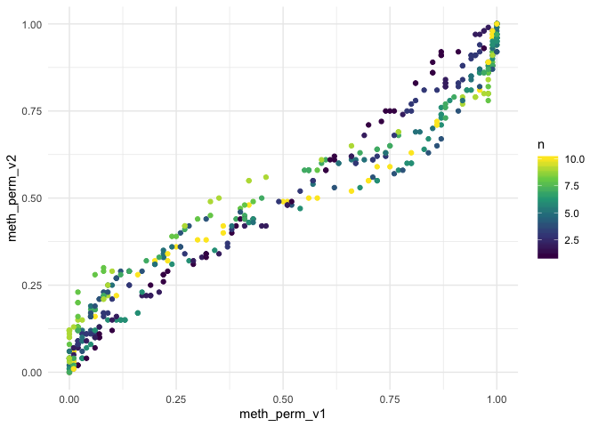

<!-- README.md is generated from README.Rmd. Please edit that file -->

# methcon5

<!-- badges: start -->

<!-- badges: end -->

The goal of methcon5 is to identify and rank CpG DNA methylation
conservation along the human genome. Specifically it includes
bootstrapping methods to provide ranking which should adjust for the
differences in length as without it short regions tend to get higher
conservation scores.

## Installation

Please note that the name of the package is in all lowercase.

~~You can install the released version of methcon5 from
[CRAN](https://CRAN.R-project.org) with:~~

``` r
install.packages("methcon5")
```

And the development version from [GitHub](https://github.com/) with:

``` r
# install.packages("devtools")
devtools::install_github("EmilHvitfeldt/methcon5")
```

## Example

Below is some sample data where we have created 500 genes with 1 to 10
sites each. Then

``` r
library(methcon5)
library(dplyr)
#> 
#> Attaching package: 'dplyr'
#> The following objects are masked from 'package:stats':
#> 
#>     filter, lag
#> The following objects are masked from 'package:base':
#> 
#>     intersect, setdiff, setequal, union
n <- 500

genes <- sample(1:10, n, replace = TRUE)

sample_data <- tibble(gene = rep(seq_len(n), times = genes),
                      cons_level = rep(sample(c("low", "medium", "high"), n, TRUE), times = genes)) %>%
  group_by(cons_level) %>%
  mutate(meth = case_when(cons_level == "low" ~ runif(n(), 0, 0.5),
                          cons_level == "medium" ~ runif(n(), 0.2, 0.8),
                          cons_level == "high" ~ runif(n(), 0.5, 1)))
```

``` r
sample_ii <- sample_data %>%
  ii_summarize(gene, meth) 

sample_ii
#> # A tibble: 500 x 3
#>     gene value length
#>    <int> <dbl>  <int>
#>  1     1 0.652      5
#>  2     2 0.233     10
#>  3     3 0.626      5
#>  4     4 0.784      3
#>  5     5 0.753      8
#>  6     6 0.796      1
#>  7     7 0.465      3
#>  8     8 0.617      7
#>  9     9 0.475      6
#> 10    10 0.162      9
#> # … with 490 more rows
```

``` r
ddd <- boot_index(sample_data, gene, meth, 100)
hist(ddd$pvalue, breaks = 100)
```


